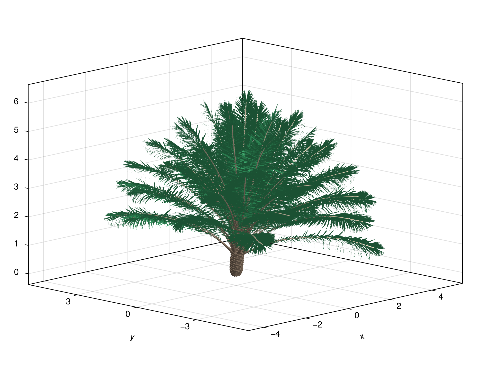

```@meta
CurrentModule = XPalm
```

# XPalm - A growth and yield model for oil palm

```@raw html
<!-- [](https://PalmStudio.github.io/XPalm.jl/stable/) -->
```

[](https://PalmStudio.github.io/XPalm.jl/dev/)
[](https://github.com/PalmStudio/XPalm.jl/actions/workflows/CI.yml?query=branch%3Amain)
[](https://codecov.io/gh/PalmStudio/XPalm.jl)
[](https://github.com/SciML/ColPrac)

[XPalm](https://github.com/PalmStudio/XPalm.jl) is a growth and yield model for oil palm (*Elaeis guineensis*).

```@contents
Pages = ["index.md"]
Depth = 5
```

## Overview

XPalm is a process-based model for simulating oil palm (*Elaeis guineensis*) growth and development. The model simulates key physiological processes including:

- Phenology and development
- Carbon assimilation and allocation
- Water balance
- Reproductive organ development
- Yield components


*Figure 1. Simplified diagram of the component models used in XPalm. The numbering is associated to the computational flow, from the first models to execute to the last.*

XPalm implements a multiscale approach, modeling processes at different organizational levels:

Scene: Environment and canopy-level processes
Plant: Whole palm processes
Phytomer: Individual growth unit processes
Organ: Leaf, internode and reproductive organ processes

The model uses a daily time step and requires standard meteorological inputs (temperature, radiation, rainfall...).

The model also includes a submodule `VPalm` to design palm tree mockups from a set of architectural parameters and allometric equations. It is designed to integrate smoothly with the physiological models from the package.

The model is implemented in the [Julia programming language](https://julialang.org/), which is a high-level, high-performance dynamic programming language for technical computing.



## Example outputs

Here are some example outputs from the model, showing the evolution of variables at different scales:

**Scene level:**

Leaf area index (LAI) at the scene level over time:


**Plant level:**

Maintenance respiration (Rm), absorbed PPFD (aPPFD), biomass of bunches harvested, and leaf area at the plant level over time:


**Leaf level:**

Leaf area at the level of the individual leaf over time:


**Soil level:**

Fraction of transpirable soil water (FTSW) over time:


## Installation

Install XPalm using Julia's package manager, typing `]` in the Julia REPL (*i.e.* the console) to enter the Pkg REPL mode and then typing:

```julia
pkg> add XPalm
```

To use the package, type the following in the Julia REPL:

```julia
using XPalm
```

## Funding

This work is supported by the PalmStudio research project, funded by the [SMART Research Institute](https://smartri.id/) and [CIRAD](https://www.cirad.fr/en).
